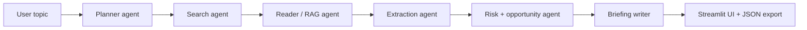

<p align="right">
  <a href="https://mohamadkanso.github.io/SignalBrief/process.html"><strong>Process</strong></a>
</p>

# SignalBrief

Autonomous AI analyst briefings for company and market research.

[Preview](https://mohamadkanso.github.io/SignalBrief/) · [Process](https://mohamadkanso.github.io/SignalBrief/process.html)

SignalBrief is a portfolio-grade AI analyst workspace. You give it a company name, sector, or research topic, and a LangGraph agent chain plans the search, collects sources, builds a retrieval index, extracts facts, identifies risks and opportunities, scores sentiment, and produces a structured briefing that can be exported as JSON.

I built this to mirror the research workflow used in consulting, hedge fund, private equity, and enterprise strategy teams: collect evidence quickly, separate signal from noise, and turn messy public information into a defensible executive brief.

## What it does

- Plans research queries from a single company or topic.
- Searches with Tavily when `TAVILY_API_KEY` is configured.
- Falls back to a deterministic demo mode so recruiters can run the app instantly.
- Builds a lightweight RAG evidence index over collected source chunks.
- Extracts key facts, metrics, risks, opportunities, and sentiment into Pydantic models.
- Shows a polished Streamlit research terminal with animated agent progress.
- Exports the final briefing as structured JSON.
- Ships with tests, Ruff linting, and a CI workflow template.

## Architecture



## Agent chain

| Agent | Responsibility |
| --- | --- |
| Planner | Converts the topic into targeted research queries. |
| Search Agent | Collects live Tavily results or demo-mode sources. |
| Reader / RAG Agent | Chunks documents and ranks source evidence. |
| Extraction Agent | Produces typed facts and numeric metrics. |
| Risk / Opportunity Agent | Scores downside, upside, and sentiment drivers. |
| Briefing Writer | Synthesises the final executive summary. |

## Quick start

```bash
git clone https://github.com/MohamadKanso/SignalBrief.git
cd SignalBrief
python3 -m venv .venv
source .venv/bin/activate
pip install -e ".[dev]"
streamlit run streamlit_app.py
```

The app works immediately in demo mode. To enable live web search:

```bash
cp .env.example .env
# add your TAVILY_API_KEY
streamlit run streamlit_app.py
```

## Deployment

1. Push the repository to GitHub.
2. Deploy the Streamlit app to Streamlit Community Cloud.
3. Set `TAVILY_API_KEY` in Streamlit secrets if live search is needed.
4. Keep the GitHub Pages preview enabled from `/docs`.
5. Use the `Process` page as the visual build narrative for recruiters.
6. Optional: move `.github/ci-template.yml` into `.github/workflows/ci.yml` when your GitHub token has `workflow` scope.

## Why I made this

I wanted a project that connected directly to the work I am applying for: AI engineering, data engineering, RAG systems, analyst automation, and decision-support tooling. A lot of firms do not need another basic time-series notebook. They need people who can build systems that read, reason, retrieve, structure, and explain.

SignalBrief is my answer to that. It shows agent orchestration, RAG, structured outputs, product thinking, UI polish, testing, and deployment readiness in one project.

## Tech stack

- Python
- LangGraph
- Streamlit
- Pydantic
- Tavily Search
- Plotly
- pandas
- pytest
- Ruff
- GitHub Actions-ready CI template

## Example output

```json
{
  "topic": "NVIDIA AI infrastructure",
  "sentiment": {"label": "Constructive", "score": 0.18},
  "sections": ["executive_summary", "key_facts", "metrics", "risks", "opportunities", "sources"]
}
```

## Roadmap

- Add OpenAI structured-output synthesis for richer analyst writing.
- Add vector embeddings through Chroma or FAISS for deeper semantic retrieval.
- Add PDF and earnings-call ingestion.
- Add scheduled company monitoring.
- Add analyst review checkpoints before publishing briefings.
